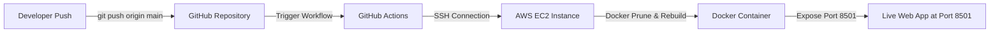

# ⚖️ Streamlit BMI Calculator (AWS EC2 + Docker + GitHub Actions)

A modern, responsive **Body Mass Index (BMI) Calculator** web application built using **Streamlit** and Python. The application features a custom **Glassmorphism UI** with animated gradient backgrounds.

This repository features a fully automated Continuous Integration and Continuous Deployment **(CI/CD) pipeline** that automatically builds and deploys the application to an **AWS EC2 instance** inside a **Docker container** upon every `git push` to the `main` branch.

---

## 🚀 Features

- **Interactive BMI Calculation:** Instant metric computation based on weight (kg) and height (cm).
- **Modern UI/UX:** Styled using custom CSS with glassmorphism cards and smooth background gradient animations.
- **Automated CI/CD:** Continuous Integration & Deployment powered by **GitHub Actions**.
- **Containerized Architecture:** Fully isolated deployment using **Docker**.
- **Resource Optimized:** Configured with 1.4GB Swap memory and automated Docker image/cache pruning to prevent Disk Space & Out-Of-Memory (OOM) crashes on AWS Free Tier (`t2/t3.micro`).

---

## 🛠️ Tech Stack

- **Frontend / Application:** Python, Streamlit, Custom HTML/CSS
- **Containerization:** Docker
- **Cloud Infrastructure:** AWS EC2 (Ubuntu 24.04 LTS)
- **CI/CD Pipeline:** GitHub Actions (`appleboy/ssh-action`)
- **Version Control:** Git & GitHub

---

## ☁️ AWS EC2 Instance Setup & Access

To host this application reliably on an **AWS EC2 `t2/t3.micro` (1GB RAM / 8GB Storage)** Free Tier instance, the following server-side configurations were implemented:

### 1. Inbound Security Group Rules
Configured AWS EC2 Security Group to allow necessary web traffic:
- **SSH (Port 22):** For remote terminal access and GitHub Actions runner deployment.
- **HTTP (Port 80):** For public web access.
- **Custom TCP (Port 8501):** To expose the Streamlit application directly.

### 2. Live Application Access
Once the container is deployed, the Streamlit application is publicly accessible via your EC2 Instance's Public IP on port `8501`:

```
Run
http://<YOUR_EC2_PUBLIC_IP>:8501
```

### 3. Swap Memory Allocation (Preventing OOM Crashes)
To prevent Out-Of-Memory (OOM) crashes during heavy `docker build` processes on a 1GB RAM instance, a **1.4GB Virtual Swap File** was configured:

```bash
sudo fallocate -l 1G /swapfile
sudo chmod 600 /swapfile
sudo mkswap /swapfile
sudo swapon /swapfile
echo '/swapfile none swap sw 0 0' | sudo tee -a /etc/fstab
```

### 4. Docker & Dependencies Installation
Installed Docker engine on the Ubuntu EC2 instance and granted permissions:

```bash
sudo apt update && sudo apt install -y docker.io git
sudo systemctl enable --now docker
sudo usermod -aG docker ubuntu
```

---

## 🔄 CI/CD & Deployment Workflow

### How it Runs on AWS (Automated Deployment)



1. **GitHub Secrets:** The deployment workflow utilizes GitHub Repository Secrets for secure authentication:
   - `EC2_HOST`: Elastic/Public IP of the EC2 Instance.
   - `EC2_USERNAME`: `ubuntu`
   - `EC2_SSH_KEY`: Private SSH Key (`.pem` file content).

2. **Automated Actions Execution:** Upon pushing code to `main`, GitHub Actions executes remote commands on EC2:
   - Cleans up old Docker build caches and dangling images (`docker system prune -af`).
   - Pulls the latest code from GitHub.
   - Rebuilds the Docker image (`docker build -t bmi-app .`).
   - Safely restarts the container (`docker run -d -p 8501:8501 --name bmi-app --restart always bmi-app`).

---

## 💻 Manual Execution on EC2 (For Troubleshooting)

If you need to manually pull and run the container on the EC2 server:

```bash
# Connect to EC2
ssh -i "your-key.pem" ubuntu@YOUR_EC2_PUBLIC_IP

# Navigate to project
cd ~/bmi-calculator

# Pull latest code & rebuild container
git pull origin main
docker stop bmi-app || true
docker rm bmi-app || true
docker build -t bmi-app .
docker run -d -p 8501:8501 --name bmi-app --restart always bmi-app
```

---

## 🐳 Running Locally with Docker

1. **Build the Docker image:**
   ```bash
   docker build -t bmi-app .
   ```

2. **Run the Docker container:**
   ```bash
   docker run -d -p 8501:8501 --name bmi-app bmi-app
   ```

3. Access the application locally at `http://localhost:8501`.

---
